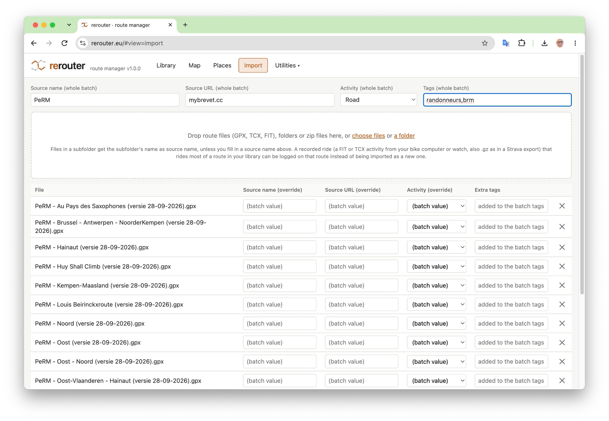
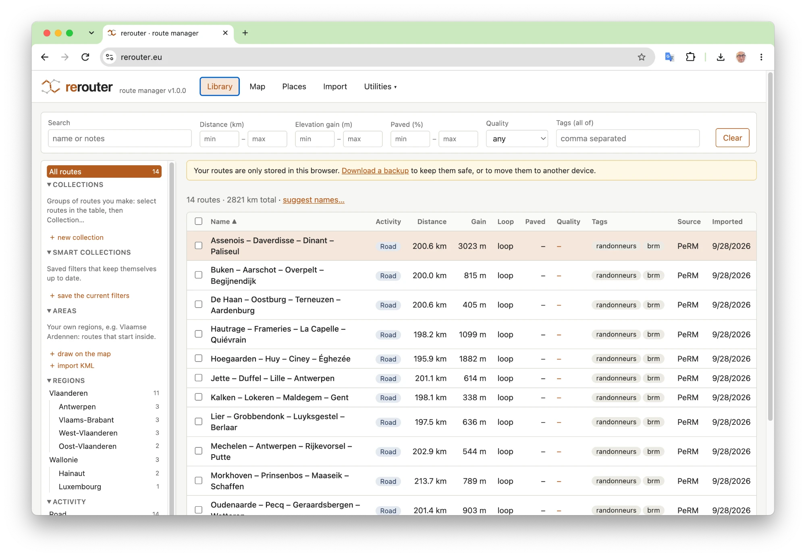
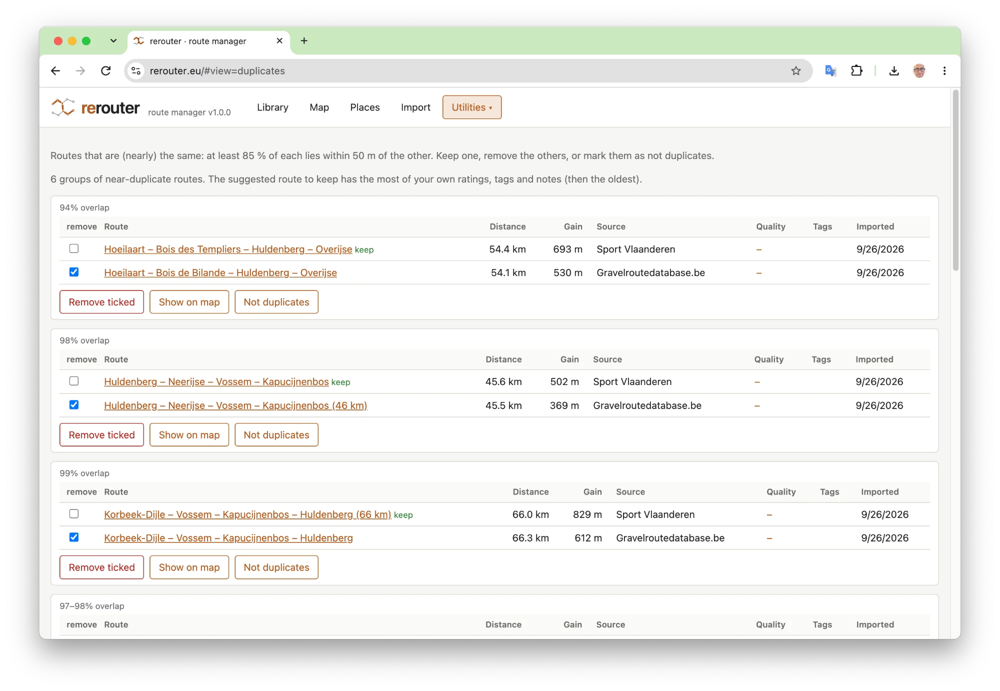
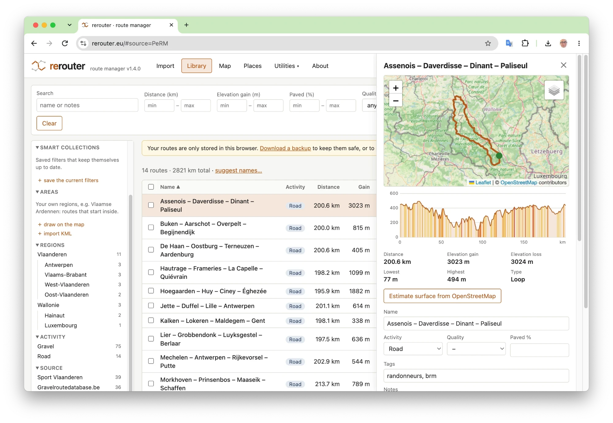
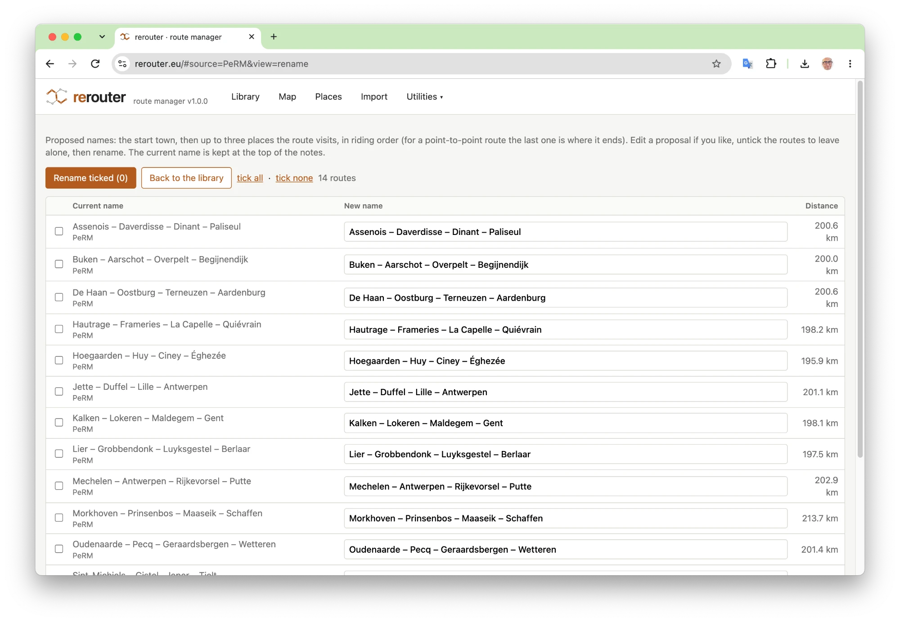
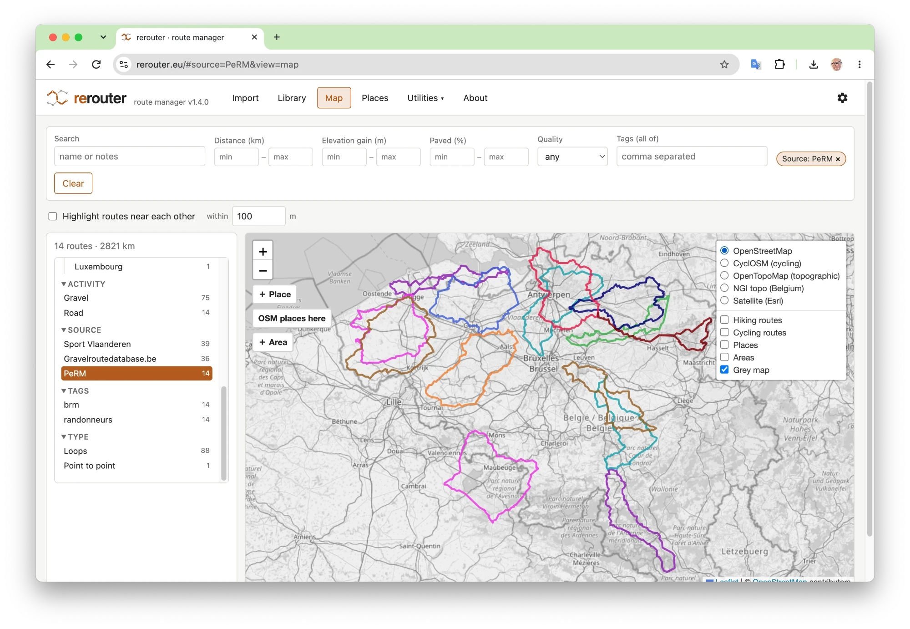
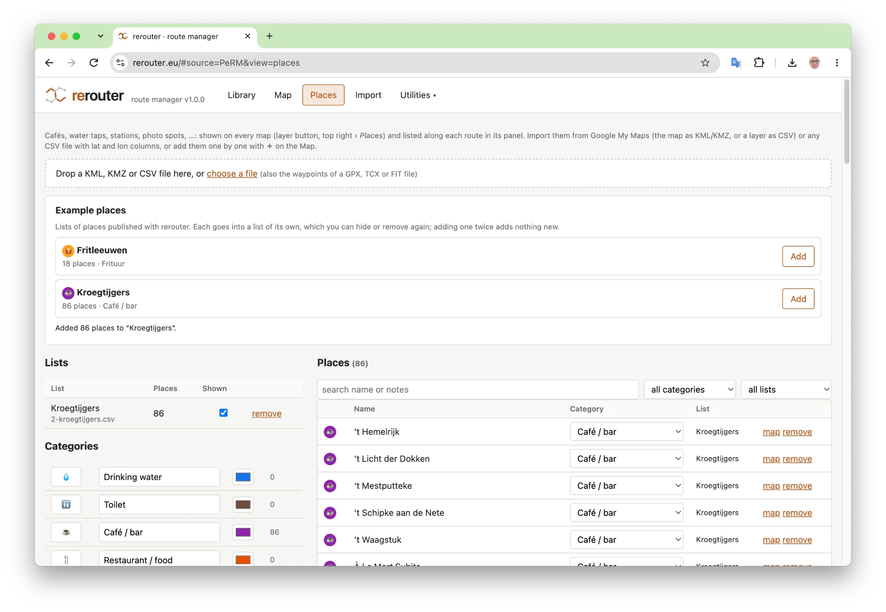
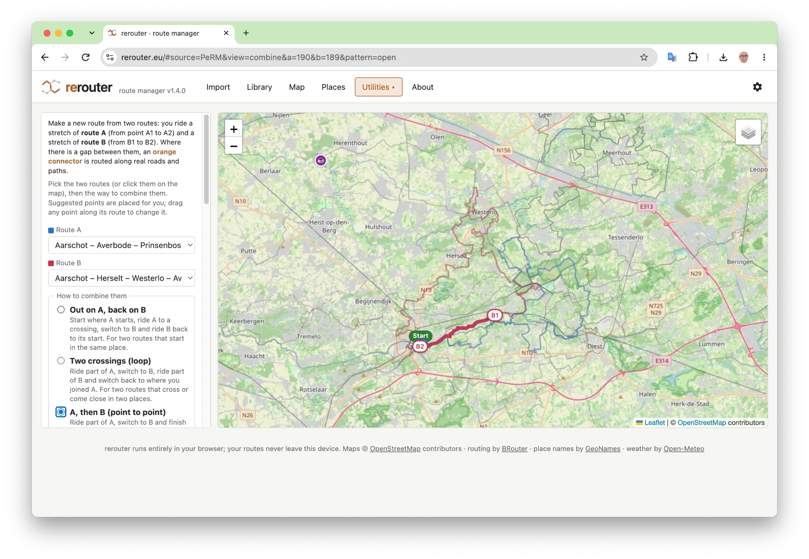
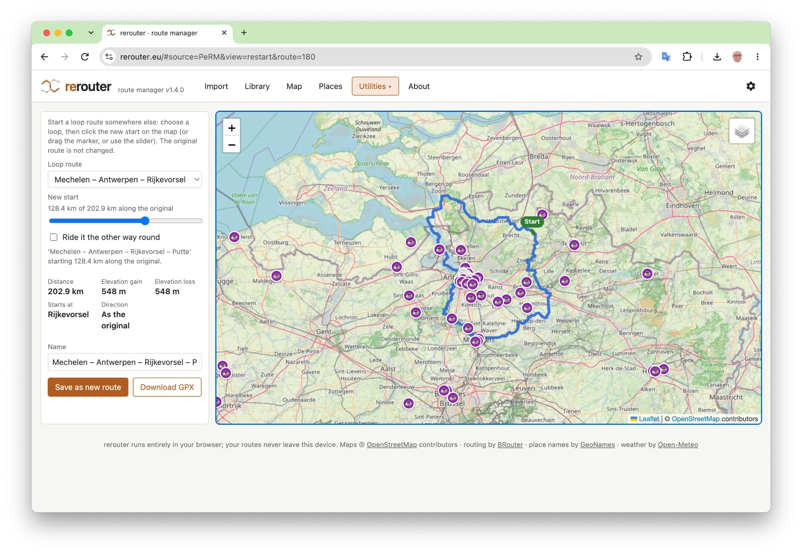
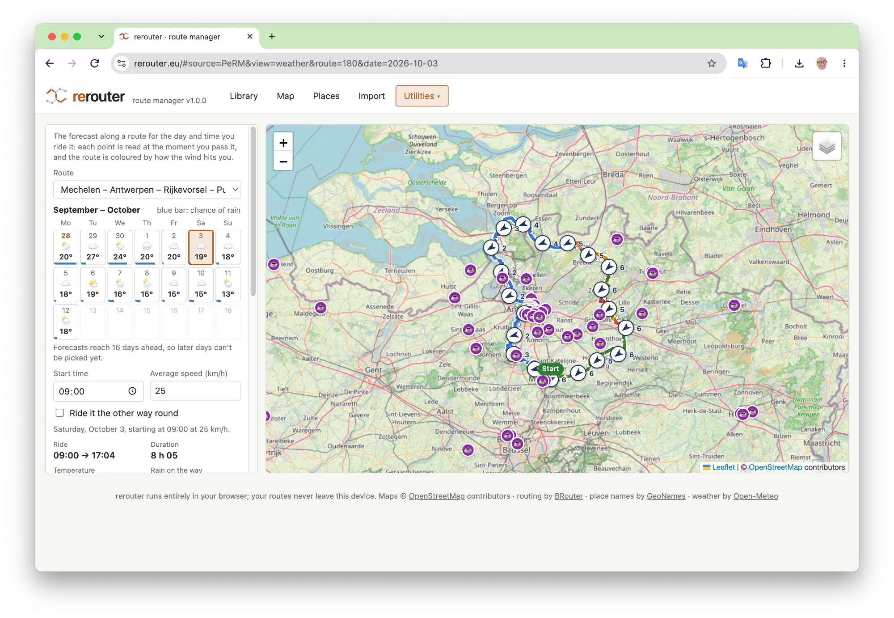

<picture>
  <source media="(prefers-color-scheme: dark)" srcset="docs/logo-wordmark-dark.svg">
  
</picture>

# rerouter — route manager

A web app to manage a personal library of routes for gravel cycling, road cycling, mountain
biking and hiking: import them (GPX, TCX, FIT, or from a link), find them again (filters,
collections, areas, regions), see them on a map with the places along them, combine them into
new routes with automatically routed connectors (via BRouter), check the weather for the day
you ride, share them with a link, and plan a day out with the train. Formerly *regraveler*.

The whole app is one page (`web/`) that runs in the browser, and it runs two ways:

- **On your own server** (`docker compose up`): the page is served by a small Python server
  that stores the library (SQLite + your GPX folder) and passes routing requests on to a
  self-hosted BRouter. Every browser on your network sees the same library.
- **As a static site** (e.g. GitHub Pages): the same page keeps the library in the browser
  (IndexedDB) and uses the public BRouter at brouter.de. Nothing to install; one browser is
  one library. **Try it: <https://rerouter.eu/>** (and read
  [Your data in the browser version](#your-data-in-the-browser-version)).

Both use the same backup format, so a library moves between them in either direction.

**Version:** 1.5.0 · **Status:** stable. What was planned and built is in
[docs/ROADMAP.md](docs/ROADMAP.md); the version
history in [CHANGELOG.md](CHANGELOG.md).

## What it does

At a glance:

- **Import** GPX, TCX and FIT files (also zipped folders, and a whole Strava export), or a
  route from a link (RideWithGPS, Komoot, Strava, any GPX file online). Stats, a descriptive
  name and the surface (paved / unpaved, from OpenStreetMap) are worked out for you; recorded
  rides of routes you have are logged on them.
- **A library** with a filter bar and a **Browse** panel: collections (nested), smart
  collections (saved filters), your own areas, regions (Vlaanderen › Antwerpen, …), activity,
  source and type.
- **A route's panel:** map, stats, elevation profile, surface, the places along it, its
  collections, and a **share link**.
- **The map** of all (filtered) routes, with map styles, a grey map, your places and areas,
  and the routes that come near each other.
- **Places:** cafés, water, toilets, stations, frituren, … from Google My Maps, CSV files,
  waypoints or OpenStreetMap, on every map and along every route.
- **Utilities:** combine two routes into a new one, start a loop somewhere else, the weather
  along a route, search for places (and ride past them), and **train rides**: a day out with
  the train, with your routes as the riding part.
- **Sharing:** a link with the route in it, route sets (zips) to add to another library,
  example routes and example places on the public site.

Original route files (GPX, TCX, FIT) are never modified: combinations, new starts and routes
with places are new files.

The menu at the top follows the order you use it in: **Import**, **Library**, **Map**,
**Places**, **Utilities**, and **About**: what rerouter is for, a short manual, who made it
(questions and ideas: [GitHub issues](https://github.com/rvanbruggen/rerouter/issues)), the
license and a disclaimer, and the open data and software it is built with. The ⚙ at the right
of the menu bar opens *Library & settings* (backups, storage, the routing server, your home).

### Importing routes

- **Import** route files by drag and drop: many files at once, whole folders or zip files. On a
  server, the Import screen also offers the route files that are already in its `gpx/` folder.
  - **Formats:** GPX, **TCX** and **FIT** (from Garmin, Wahoo and other bike computers and
    watches), also gzip-compressed (`.fit.gz`, `.tcx.gz`, as in a Strava bulk export). The
    original file is stored as it is; *Download GPX* in the route panel writes a GPX file for a
    TCX or FIT route, and *Original .fit* / *Original .tcx* gives the original.
  - **Rerouter zips:** a set made with *Export set…* (or a backup), from this or another
    rerouter, dropped on the Import screen is added as a set with its details (activity, tags,
    notes, ratings, places, collections), like *Add routes from a zip…*: nothing is replaced.
  - **Activity from the file:** a FIT or TCX file that says it is a run or walk becomes hiking,
    and a FIT file with the mountain, road or gravel sub-sport becomes that activity. Otherwise
    the batch's activity is used (a per-file override always wins).
  - **Recorded rides:** a FIT or TCX *activity* (a ride you recorded, not a planned course) that
    covers at least 80% of a route in the library is not imported as a new route. The results
    say which route it is, with *Log as ridden* (the route panel then lists the dates you rode
    it) or *Import as a new route*; *Log all … recorded rides* does the whole batch. The same
    recorded file is logged only once.
  - Source name, URL and **activity** (gravel, road, mountain biking or hiking; default gravel) per batch, with
    per-file override. If no URL is given, the link inside the GPX file (if any) is used.
  - **Tags** for the whole batch, plus optional extra tags per file (added to the batch tags).
  - Computed on import: distance, elevation gain/loss (smoothed, see below), min/max elevation,
    start/end point, bounding box, loop detection (start and end within 200 m) and a
    simplified geometry for maps.
  - A GPX file with several tracks (e.g. `Start Bertem.gpx`, which holds 5 routes) becomes one
    route per track.
  - **Duplicates:** an identical file (same SHA-256) is skipped, and so is the same track in a
    different file (same coordinates, but e.g. another name, encoding or creator). Routes with
    very similar geometry (≥ 85 % of each route within 50 m of the other) are imported but
    flagged.
  - **Surface:** after an upload, the paved % of the new routes is estimated in the background
    from OpenStreetMap (see below). In the browser version this is off by default (it would send
    many requests to the shared public BRouter server); switch it on under *Library & settings*.
  - **Name:** new routes are named after the places they visit (see *Route names*); the name
    from the file is kept at the top of the notes (`Original name: …`).



- **Import from a link:** paste a link and rerouter fetches the route, shows its name and
  distance, and pre-fills the source (the service or site + the link), the activity and the
  notes (the route's description). The route is then imported like a GPX file: named by your
  naming setting (the original name goes into the notes), and checked for duplicates.
  - **RideWithGPS** routes and rides (`ridewithgps.com/routes/…`, `/trips/…`), if public.
  - **Komoot** tours (`komoot.com/tour/…`, any language), if public, or private ones shared
    with you by a link with a `share_token` in it. Komoot's "gravel ride" becomes Gravel.
  - For both, their surface figure can be used as the paved % (it then counts as yours),
    instead of rerouter's own estimate. Both let any website read their public route data,
    so this works in the browser version too.
  - **Strava** links are recognised, but Strava only hands out a route's GPX to someone signed
    in to Strava: rerouter gives you the export link, you download the GPX (signed in), choose
    the file, and it is imported with the Strava link as its source.
  - **Any other link to a GPX file** is fetched and imported unchanged, if it is a GPX file.
    In the browser version that only works when the site lets other websites read its files
    (many don't; then download the file and use the Import screen). A rerouter server fetches
    such files itself, only from public internet addresses (never from your own network), at
    most 20 MB, and only GPX files.

### The library

- **Library:** sortable table with a filter bar (search, distance, elevation gain, paved %,
  quality, tags) and the **Browse** panel beside it for activity, source, type (loop or point
  to point), collections, areas and regions; what is chosen in Browse shows as chips in the
  filter bar (× removes one, *Clear* all). The Map has the same filter bar, with *Highlight routes near
  each other* right under it, and in its side panel the route count and the Browse panel. Filters are kept in the URL.

- **Browse (catalog):** beside the library table (on a phone behind *Browse*), a tree to find
  routes by group; a click filters the table and the map (a chip in the filter bar shows a
  collection or area, × to show all routes again), and each entry shows its number of routes.
  - **Collections:** groups you make, one inside another (*Trips › Ardennes 2026*); a route
    can be in several. Select routes and use **Collection…** (pick one, or type a new name; `›`
    makes one inside another), or *add to…* in a route's panel, which lists its collections.
    A collection shows the routes in it and in the collections inside it. ✎ renames, ✕
    removes a collection (the routes stay; the collections inside it move up a level).
  - **Smart collections:** saved filters (*save the current filters*), e.g. "gravel, 60–90 km,
    paved under 40 %", which keep themselves up to date; a click sets the filters again.
  - **Areas:** your own regions, such as *Vlaamse Ardennen* or *Kempen*: the routes that
    **start** inside. Draw one on the Map (**＋ Area**: click its corners, then click the
    button again, Esc to stop) or import them from a KML/KMZ file (areas drawn in Google My
    Maps). The *Areas* layer (layer button) shows them on the maps; a route's panel says which
    areas it starts in.
  - **Regions:** region › province of the route's start (e.g. *Vlaanderen › Vlaams-Brabant*,
    *Nederland › Zeeland*, *Hauts-de-France › Nord*; see *Regions* below), found from the
    place data; a route's panel says where it starts.
  - **Activity, source, tags, type** (loop or point to point), counted from the routes.

  Collections and areas are in backups, and *Export set* takes along the collections of the
  chosen routes (with their parent collections) and the areas they start in; adding the set
  merges them (same name in the same place: the same collection).

- **Activity:** every route is a gravel, road, mountain biking or hiking route (routes from
  before 0.6.0 start as gravel). Change it in the route panel, or for a selection with *Set
  activity…*. The activity also picks the combiner's routing profile (gravel → `gravel`,
  road → `fastbike`, mountain biking → `mtb`, hiking → `hiking-mountain`) and the default speed
  for the ride weather (20, 25, 15 and 4.5 km/h).

- **Select several routes** with the checkboxes in the library (the header box selects all
  shown routes), then:
  - **Download GPX:** one route downloads its original file; several download as `routes.zip`
  - **Export set…:** a rerouter zip with the selected routes, their details (activity, tags,
    surface, …, optionally your notes and ratings) and their original GPX files, to add to another library
    (see [Sharing and example sets](#sharing-and-example-sets))
    with the original files (a multi-track file is included once).
  - **Show on map:** the map (and library) show only the selected routes until you click
    *show all routes* or *Clear*.
  - **Tags…:** add one or more tags to all selected routes, or remove a tag from all of them
    (the panel lists the tags on the selection with how many routes have each, e.g. `forest 3/5`).
  - **Estimate surface:** (re)estimates the paved % from OpenStreetMap; progress is shown next
    to the route count.
  - **Remove:** removes them from the library after one confirmation (on a server the GPX files
    stay in the `gpx/` folder; in the browser version they are removed with the routes).



- **Duplicates:** all groups of near-duplicate routes in the library (e.g. the same route
  downloaded from two sites), with overlap, source, rating and tags per route, "identical
  track" and "ridden the other way" hints, and a suggestion which one to keep (the one with the
  most of your own ratings, tags and notes, then the oldest). *Remove ticked*, *Show on map*, or
  *Not duplicates* (hides the group). Below that, **variants**: routes that lie (almost)
  entirely on a longer route, such as a short loop inside a long one.



### A route's panel

- **Route details:** map, stats, edit metadata (name, quality 1–5, paved %, tags, notes,
  source), list of similar/overlapping routes, download of the original GPX, remove from library.

- **Elevation profile:** the route panel shows the elevation along the route (the same smoothed
  profile the elevation gain is computed from), with climbs coloured by gradient (3–6 %, 6–9 %,
  9 % and steeper, measured per 100 m). Hover the chart to see the km, elevation and gradient
  there and a marker on the map; hover the route on the map to see that point on the chart.
  Files without elevation show no chart.

- **Surface from OpenStreetMap:** each route's surface is estimated as *paved*, *cobbles*
  (sett/cobblestones, counted as paved), *unpaved* and *unknown*. The route panel shows the
  breakdown as a bar, colours the map by surface, and has *Estimate again*. The paved % in the
  library comes from the estimate (shown as ≈38%) unless you type your own value, which then
  always wins; the panel offers *use the estimate* to switch back, and clearing the field does
  the same. Needs BRouter (see Docker); routes outside the downloaded tiles can't be estimated.
  The browser version uses the public BRouter at brouter.de, one request at a time.



- **Route names:** *suggest names…* above the library (or *Rename…* for selected routes) opens
  a review screen with a proposed name per route: the start town, then up to three places the
  route visits, in riding order, e.g. *Tervuren – Kapucijnenbos – Duisburg – Hogenbos* (for a
  point-to-point route the last place is where it ends). Edit proposals, untick routes to leave
  alone, and rename; the current name is kept at the top of the notes (only the first time).
  Routes with the same proposal get the distance added.



- **Share…** makes a link to the route: see [Sharing](#sharing-and-example-sets) below.

### The map

- **Map:** all routes that match the filters (the same filter bar as the library) drawn as
  coloured lines on an OpenStreetMap map. Hover for the name, click a route to open its details
  (the side list then shows only the routes near it). "Show on map" in the route panel jumps there.

- **Map styles:** every map has a layer button (top right) to switch between OpenStreetMap,
  CyclOSM (cycling, shows unpaved roads), OpenTopoMap (contour lines), the Belgian NGI topo map
  and Esri satellite, with the signposted hiking and cycling routes of Waymarked Trails as
  optional overlays. All are free and need no key; the choice applies to every map and is
  remembered in this browser. **Grey map** (in the same layer button) shows the base map in grey, so
  the coloured routes, places and overlays stand out; it is set per map (grey at first on the
  overview Map, in colour on the others, such as a route's panel) and remembered. The list is `MAP_STYLES` / `MAP_OVERLAYS` in `web/js/config.js`.

- **Routes near each other:** tick *Highlight routes near each other* and set a distance
  (default 100 m). Routes that overlap or come within that distance of another route stay
  coloured, the rest fade out. Shared stretches are drawn in yellow, and for near misses a
  dashed line marks the closest points. The side list shows every pair (shared km, % of each
  route, or the gap in metres); click a pair to zoom to it.
- The filters, the active view and the proximity setting are kept in the URL, so a bookmark
  brings back the same screen.



### Places

- **Places (POIs):** cafés, water taps, stations, photo spots, … on every map (layer button ›
  *Places*) and listed along each route in its panel ("Places along this route": the km where
  you pass it and how far off the route, within 200 m). The **Places** tab:
  - **Import** a Google My Maps map (*Export to KML/KMZ*: each layer is offered with a suggested
    category, from the layer's name or its icon, e.g. a Transport layer split into stations and
    parkings) or a layer's CSV export, or any CSV file with name and lat/lon columns (`;` and
    decimal commas work; optional category/type, notes and link columns). Pick a category per
    layer or let a layer become a new category; a layer of one place that is nothing known
    (often a home address) is left out unless you tick it. Importing the same file again adds
    only new places.
  - **Example places:** ready-made lists to add with one click (see *Sharing routes and example
    sets* below).
  - **Lists** (one per imported map, plus *My marks*): show or hide a whole list, or remove it.
  - **Categories:** built-in ones (drinking water, toilet, café / bar, restaurant, frituur,
    bike shop, train station, belfry, castle, abbey, sight, photo spot, shelter, hotel, parking,
    other) and your own;
    change the symbol, name and colour.
  - **＋ Place** on the Map: click it, then on the map, and fill in the name, category, notes
    and a link (a photo album, a website). Click a place on any map to see or edit it.
  - **Waypoints:** the waypoints in a GPX file (and the course points of a FIT or TCX course,
    not its turn instructions) can be imported as places: drop the file on the Places tab, or
    *Add the N waypoints in its file to your places…* in a route's panel.
  - **From OpenStreetMap:** *Also look on OpenStreetMap* in a route's panel lists the places
    mapped on OpenStreetMap along the route (drawn as rings), within the distance chosen next
    to it (100 m, 200 m, 500 m, 1 km or 2 km; 200 m to start with, remembered in the browser;
    changing it searches again; further takes longer and finds more: on a 295 km route 58
    places within 200 m, 157 within 1 km in 16 s). Your own places along a route stay at 200 m. and **OSM places here** on the Map
    looks in the part of the map you see (zoomed in). Which kinds to look for is set on the
    Places tab (default: water, toilets, bike repair, stations, shelters, viewpoints; bus
    shelters are left out). They are not stored until you keep them: along a route, tick the
    ones you want (or use *all*, *none*, or a category button such as 🚻 9 to tick all toilets)
    and *Keep N selected as my places*, into *From OpenStreetMap*, one of your lists, or a new
    list named after the route; on a map, *Keep as my place* in a place's popup. Places you
    kept are not offered again. They come from the free Overpass API, which is often busy: rerouter
    only asks when you click, tries a few servers in turn, asks for the route's bounding boxes
    (far quicker than "along a line"), keeps answers for a week (in the browser; a rerouter
    server passes the questions on and keeps the answers for a day, `OVERPASS_URLS`,
    `OVERPASS_TIMEOUT_S`, `OVERPASS_CACHE_S`), and says so when none answers.
  - **Combine through a place:** each connector can be routed through one of your places near
    it (listed with the extra km), e.g. a café or a water tap on the way back.
  - **Sets:** *Export set…* includes the places along the chosen routes (with their lists and
    your own categories; *Include the places along these routes*), and adding a set adds its
    places (lists with the same name merged, places already there skipped).



### Utilities

The *Utilities* menu in the header has the operations on routes:

- **Combine** two routes into a new one by picking the part of each route you want to ride:
  1. Pick route A and B (dropdowns, click them on the map, "Combine…" in a route's
     detail panel, or "combine" next to a pair in the map's proximity list).
  2. Choose how to combine them (the screen explains each):
     - **Out on A, back on B:** start where A starts, ride A to a crossing, switch to B and ride
       B back to its start: A1 is A's start, B2 is B's start. The crossing is where the routes
       come closest, but well away from their starts (routes that share a start are closest
       right there). A loop route B is ridden on in its own direction to its start/finish;
       any other route B is ridden backwards.
     - **Two crossings (loop):** A1 → A2 → connector → B1 → B2 → connector back to A1.
     - **A, then B (point to point):** A1 → A2 → connector → B1 → B2.

     When the two routes start within 1 km of each other the screen starts with *Out on A, back
     on B*, otherwise with the loop. The app suggests the four points for the chosen pattern:
     you ride route A from A1 to A2 and route B from B1 to B2.
  3. Change them with *Click all four* (click A1, A2, B1, B2 on the map in turn; Esc cancels),
     *Place* next to a single point, or drag a point along its route. Clicks snap onto the
     route. *Suggest* puts the suggested points back.
  4. The gaps are filled with connectors routed by BRouter (the profile follows the routes'
     activity: *gravel*, *fastbike* for road, *mtb* for mountain biking, *hiking-mountain* for
     hiking; for gravel optionally
     *prefer unpaved paths*; other profiles or plain straight lines are possible).
     Points less than 25 m apart are joined directly.
  5. Preview with total distance, elevation gain, the km on each route and connector lengths,
     and **Your ride**: the combined route in words, step by step (where you start, how far
     you ride on each route and in which direction, each connector).
  6. Save as a new route (a new GPX file in `gpx/derived/`, source *combined*, with the parent
     routes recorded and linked in its detail panel), or just download the GPX.
  - A loop starts at A1.
  - The riding direction on a route follows the order of its two points: *Swap A1 ↔ A2* (or
    B1 ↔ B2) rides it the other way. When the connectors of a loop cross each other, the app
    says so; swapping B1 and B2 usually fixes it. For loop routes, *Other way round A/B* takes
    the other part of that loop (through its start). *Ride the whole result the other way*
    reverses the direction.



- **Change start point** of a loop route: choose a loop (dropdown, click it on the map, or
  *Change start…* in a loop's detail panel), then click where it should start (clicks snap onto
  the route), drag the *Start* marker, or use the slider. The preview shows the stats, the town
  where it now starts and the first kilometre in green, so the riding direction is visible;
  *Ride it the other way round* reverses it. Download the GPX, or save it as a new route (a new
  file in `gpx/derived/`, with the original linked as its parent and its tags, activity,
  rating, paved % and source copied). The new route is marked as "not duplicates" of the
  original, so the Duplicates utility doesn't suggest removing one of them.



- **Ride weather:** the forecast along a route for the day you ride it. Choose a route (dropdown,
  click it on the map, or *Weather…* in its detail panel), pick the day in the calendar (today
  and the next 15 days, each with its weather, top temperature and a bar for the chance of rain;
  later days can't be picked, as there is no forecast for them yet), and fill in the start
  time and your average speed (remembered per activity). Every point along the route is read at
  the moment you pass it, so a morning, afternoon or evening start give different answers. The
  panel shows the temperature range, the rain expected on the way and its chance, the wind and
  gusts, how many km you ride into the wind or with it behind you, and the wind in the first
  and second half. The map colours the route red (headwind), amber (crosswind), green
  (tailwind) or blue (calm), with wind arrows (pointing where the wind blows to, in km/h; hover
  for the full forecast at that point and time). A table compares start times from 06:00 to
  20:00 (click one to use it). When riding the route the other way round is clearly easier on
  the wind, the panel says so and offers to flip it (⇄ in the table). The forecast comes from
  [Open-Meteo](https://open-meteo.com/) (free, no key); only about 2 to 21 points along the route are sent.



- **Search for places** (Utilities menu, or *Places…* in a route's panel): the places along a
  route, from **your places** and/or **OpenStreetMap**, within a distance you choose (100 m to
  2 km) and of the kinds you tick (kinds marked * exist only among your own places). They are
  listed in riding order (km, and how far off the route) and shown on the map. Select them with
  tick boxes, *all* / *none* / *mine*, a button per kind, or by clicking them on the map. Then
  **Show the route** with the selected places:
  - *Add them as waypoints*: the same track, with the places as GPX waypoints, which a bike
    computer shows along the way;
  - *Ride to each place*: for places more than 30 m off the route, the route leaves some way
    before the place (about twice as far as it lies off the route, 300 m to 3 km) and rejoins
    it after, routed through the place by BRouter; places close together share one detour.

  The preview gives the distance, the extra km, the climbing and each detour. **Save as new
  route** (linked to the original; with waypoints only it is the same track, kept out of the
  duplicates) or **Download GPX**. *Keep the OpenStreetMap ones as my places* stores the
  selected OpenStreetMap places in a list named after the route. When OpenStreetMap is busy,
  your own places are still found.

- **Train rides** (Utilities): a day out with the train, with your library routes as the
  riding part. Four kinds: **ride out, train back** (a route that starts near home, the train
  home from a station near its end), **train out, ride home**, **train out and back** (point
  to point, station to station) and **a loop from a station**. Point-to-point routes are tried
  both ways round. It needs your **home** (*Library & settings*; the home station is the nearest
  one, or choose another within 15 km). Choose the date, when you leave home, the kinds of trip,
  the transfers (at most), how far a route may lie from a station (1–5 km), the riding km, your
  speed and the activities. rerouter first finds the routes that fit (offline, from
  `web/data/stations.json`: the train stations of Belgium, the Netherlands, Luxembourg, the north
  of France and the west of Germany, from OpenStreetMap by `web/tools/build_stations.py`;
  stations closer than 10 km to your home station don't count), then asks the timetables for
  the best ones (8; each kind gets its turn), from
  [Transitous](https://transitous.org/) (Europe) with [iRail](https://irail.be/) (SNCB/NMBS) as
  a fallback between Belgian stations, and times the whole day: from home to the station, the
  train (10 minutes to spare), the ride, the train back, home. Each trip shows its trains (with
  the train numbers and transfers), the riding km, the climbing and when you are back home; a
  trip on the map shows the route and the stations. *Ride weather* opens the weather for that
  route, day and time; *Save the riding part as a route* makes it one route from station to
  station (connectors by BRouter; tag *train*), or *Download GPX*. A bike on a train needs a
  ticket of its own, and not every train or station suits a bike: check before you go.

### Sharing and example sets

**Share link:** *Share…* in a route's panel makes a link to a page that shows the route (map,
stats, surface, elevation profile) with *Download GPX* and *Add to my library* (source *shared
link*). The route is **in the link itself**, after the `#`, which browsers never send to a
server: nothing is uploaded or stored. The track is simplified (5 m, more for long routes)
until the link is at most about 7,000 characters (all 173 example routes fit; distances stay
within 1 %), then compressed. Your notes and the source link go along only when you tick them.
From a rerouter server the link points to the public site (`PUBLIC_SITE_URL`,
https://rerouter.eu/), so anyone can open it; on the public site, to itself. On a phone the
system share sheet can send it.

**Home and privacy:** set your home under *Library & settings › Home* (click the map; a
privacy zone of 500 m to start with). Shared routes then leave out their start and end within
that zone (the page says how much was left out); a route that passes home in the middle keeps
that part. Home stays in your library and is never shared.

*Export set…* (select routes in the library first) writes the same zip format with only those
routes, a name for the set, and no settings. *Library & settings › Add routes from a zip…*
(or dropping the zip on the Import screen) adds such a set, or a whole backup, to a library **without replacing it**: the routes get new
ids, routes the library already has (the same track) are skipped, and "derived from" links and
"not duplicates" decisions between routes in the set are kept. This works in both directions
between the server and the browser version. *Leave out my notes and quality ratings* (on by
default) keeps those out of the zip, for a set you share or publish.

**Example sets on the public site:** zips in `web/data/seeds/` are offered to visitors, on the
Import screen while the library is empty (an empty library starts there, and the Library tab
links to it) and under *Library & settings › Example routes*. To publish
one: export a set, put the zip in `web/data/seeds/` (a prefix like `1-` sets the order), run

```bash
python3 web/tools/build_seeds.py
```

to rebuild `web/data/seeds/index.json` (the list the page reads), and push.

**Example places:** CSV files in `web/data/place-sets/` are offered on the *Places* tab under
*Example places*, each with an *Add* button. A set goes into a list named after it, every place
in the set's own category, without the import preview; adding it again adds nothing (places
already there are skipped). The files are in the Google My Maps layer export format (`WKT`,
`name`, `description`) or any CSV the Places tab reads. Published now:

| File | Title | Category | Places |
|---|---|---|---|
| `1-fritleeuwen.csv` | Fritleeuwen | frituur | 18 |
| `2-kroegtijgers.csv` | Kroegtijgers | cafe | 86 |
| `3-mybrevet-belfries.csv` | MyBrevet.cc – Belfries | belfry | 56 |
| `4-mybrevet-castles.csv` | MyBrevet.cc – Castles | castle | 911 |
| `5-mybrevet-abbeys.csv` | MyBrevet.cc – Abbeys | abbey | 37 |

To publish one: put the CSV in `web/data/place-sets/` (a prefix like `6-` sets the order), give
it a title and category in `SETS` in `web/tools/build_place_sets.py` (otherwise the file name
and *Other*), run

```bash
python3 web/tools/build_place_sets.py
```

to rebuild `web/data/place-sets/index.json` (`{file, title, category, count}` per set), and
push. The section is hidden when the index is missing or empty.

### Library & settings

- **Library & settings** (the ⚙ at the right of the menu bar): where the library is stored and how much
  space it takes, **backup** (one zip with every route, your ratings, tags and notes, places,
  collections and areas, and all original route files) and **restore**, *Add routes from a
  zip…* and the example routes, the BRouter server to use (with a test button), whether new
  routes are named and their surface estimated automatically, your **home** (for share links
  and train rides), and *Remove everything*.

## Run with Docker

```bash
docker compose up -d --build
```

Open http://localhost:8082 (or `http://<server>:8082`).

The first start downloads BRouter's routing data for Belgium and its surroundings
(~640 MB, see [BRouter routing data](#brouter-routing-data)) and builds BRouter from source, so
it takes a few minutes. Later starts are quick.

Volumes (bind mounts next to `docker-compose.yml`):

| Host folder | In container | Contents |
|---|---|---|
| `./data` | `/data` | `routes.db` (SQLite) |
| `./gpx` | `/gpx` | The route files (GPX, TCX, FIT). Files already here are referenced in place; uploaded files are stored in `gpx/uploads/<source>/`, combined routes, new start points, routes with places and train rides in `gpx/derived/`, files from a restored backup that weren't here yet in `gpx/restored/`. |
| `./brouter/segments4` | `/segments4` (brouter) | BRouter routing data tiles (`.rd5`) |

Services: `app` (serves the page, stores the library, passes `/brouter` requests on to
BRouter, fetches GPX files for *Import from a link* when a site won't let the page do it, and asks OpenStreetMap for places), `brouter` (routing engine, built from the official
[abrensch/brouter](https://github.com/abrensch/brouter) v1.7.10 source; only reachable through
the app, not published on the host) and `brouter-segments` (one-off job that downloads missing
routing data before BRouter starts).

### BRouter routing data

BRouter needs routing data tiles from [brouter.de/brouter/segments4](https://brouter.de/brouter/segments4/):
5×5 degree files named after their south-west corner. The default set covers Belgium and the
neighbouring areas:

| Tile | Covers | Size (approx.) |
|---|---|---|
| `E0_N50` | 0–5° E, 50–55° N: Flanders, Brussels, west of the Netherlands | 80 MB |
| `E5_N50` | 5–10° E, 50–55° N: Limburg, east of the Netherlands, western Germany | 180 MB |
| `E0_N45` | 0–5° E, 45–50° N: south of Wallonia, northern France | 130 MB |
| `E5_N45` | 5–10° E, 45–50° N: Luxembourg, the Ardennes south of 50° N | 250 MB |

To use other tiles, set `BROUTER_TILES` (space separated) in a `.env` file next to
`docker-compose.yml`, e.g. `BROUTER_TILES=E0_N50 E5_N50`, and run `docker compose up -d`.
If a connector falls outside the downloaded tiles, the combiner says which tile is missing.

The tiles are rebuilt weekly from OpenStreetMap. To refresh them (only changed tiles are
downloaded), then restart BRouter:

```bash
docker compose run --rm brouter-segments update
```

```bash
docker compose restart brouter
```

### Import an existing folder of route files

Put the files somewhere under `./gpx` (subfolders are fine), open the Import screen and click
*Add them to the list*: it lists every route file (GPX, TCX, FIT) in the folder that isn't in the library yet.
Files in a subfolder get the subfolder's name as source name (unless you fill in a source name
for the batch), and they are referenced where they are, not copied. Doing it again is safe:
files that are already imported are not offered again, and neither are files that were skipped
(the same track as a route already in the library, or not a usable GPX file) or that you
dismissed with *Ignore them*. That goes by content, so every copy of such a file is ignored;
the files themselves stay in the folder, and *offer them again* brings them back. Dropping a folder on the Import screen
works too; files that aren't in `./gpx` yet are then copied into `gpx/uploads/<source>/`.

### Upgrading from 0.7.x (the Python version)

Up to 0.7.x the route logic ran in Python on the server. Now it runs in the page, and the
server only stores the library. The first start moves your library to the new storage by
itself: every route with its id, ratings, tags, notes, surface estimate and "not duplicates"
decisions, referencing the GPX files where they are. Routes from early versions without a
track hash get one from their GPX file the first time the page opens, so duplicates are
recognised. The old tables stay untouched in
`routes.db`, so the old version still works on the same database. By hand:
`docker compose run --rm app python -m app.cli migrate`.

GeoNames data is no longer downloaded into `data/geonames/`: the place data ships with the page
(`web/data/places/`). That folder can be deleted.

### Backups

*⚙ Library & settings › Download backup* (or `docker compose run --rm app python -m
app.cli backup /data/backup.zip`) writes one zip: `library.json` with every route, setting and
"not duplicates" pair and document (places and their lists, collections, smart collections,
areas), and every original route file as `gpx/<sha256>.<gpx|tcx|fit>`. Restoring it (in the
page, or `python -m app.cli restore <file>`) replaces the library; route ids are kept. The
browser version reads and writes the same format.

## Run as a static site (GitHub Pages)

The `web/` folder is the whole app. Served by any static web server it keeps the library in the
browser; it must be served over http(s), not opened as a file.

```bash
python3 -m http.server 8000 --directory web
```

On GitHub, `.github/workflows/pages.yml` runs the JavaScript tests and publishes `web/` to
GitHub Pages on every push to `main` that touches it: this repository's version is live at
<https://rerouter.eu/> (a custom domain for <https://rvanbruggen.github.io/rerouter/>, which
redirects there). In a fork, turn it on once under *Settings › Pages ›
Build and deployment › Source: GitHub Actions*; the app is then at
`https://<user>.github.io/<repo>/`.

### Search engines and link previews

The app is one page, and its views (Library, Map, Combine, …) are chosen after the `#` in the
address, which search engines leave out. So every feature also has a small static page of its
own in `web/features/` (*Combine two routes into a new ride*, *The weather along your route*,
…, and an overview at `features/index.html`, linked from the app's footer), with its own
address, title, text and screenshot, and a button that opens that part of the app. The pages,
their screenshots (copied from `docs/screenshots/`) and `web/sitemap.xml` are made by

```bash
python3 web/tools/build_feature_pages.py
```

from the texts in its `PAGES`: change them there, run it and push (`web/tests/feature_pages.test.js`
checks that the sitemap and the pages agree).

`web/robots.txt` lets search engines crawl the site and points them to `web/sitemap.xml`;
the `<head>` of `web/index.html` has a canonical URL, Open Graph / X (Twitter) tags for link
previews (with `web/og-image.jpg`, 1200×630) and a schema.org `WebApplication` description.
All of them name `https://rerouter.eu/`: a fork on another address changes them to its own.
Shared routes are never indexed: they live after the `#` in the link, which search engines
leave out. To get the site listed, register it once in
[Google Search Console](https://search.google.com/search-console) and
[Bing Webmaster Tools](https://www.bing.com/webmasters) (DuckDuckGo gets most of its results from
Bing) and submit `https://rerouter.eu/sitemap.xml` in both.

### Your data in the browser version

Everything stays on the device: the routes and the original GPX files are in the browser's own
database (IndexedDB), for this browser and this site address only. Nothing is uploaded. The
only data sent anywhere are the points being routed, to the BRouter server (the public one at
brouter.de by default, which allows requests from any web page; *Library & settings* can point
it at your own BRouter, as long as that one allows cross-origin requests).

**Safe:** refreshing the page (a hard refresh, Ctrl+Shift+R, too: it only reloads the page's
files), closing the tab or the browser, restarting the computer, and new versions of rerouter.

**Gone, or out of reach:**

- **Clearing the site's data:** "Cookies and other site data" in the browser's *Clear
  browsing data*, for all time or for this site.
- **Private or incognito windows:** everything goes when the window closes.
- **Safari** (Mac, iPhone, iPad) deletes a site's data after 7 days of using Safari without
  visiting that site. In Safari the app warns about this on the Import screen (while the library is empty) and reminds you
  of a backup after 7 days instead of 30.
- **Low disk space:** browsers may remove site data to free up space. After the first import
  the app asks the browser to keep its storage (*Library & settings* shows whether it agreed):
  Chrome and Edge usually agree without asking, Firefox asks you, Safari promises nothing.
- **Another browser, browser profile or device** has its own, separate (empty) library.
- The storage belongs to the site's address, and all GitHub Pages projects of one account share
  one address (e.g. `rerouter.eu`): clearing the site data of that address clears it
  for all of them.

**So:** download a backup now and then (*⚙ Library & settings › Download backup*) and
keep it outside the browser, e.g. in a cloud folder. The library reminds you when the last
backup is more than 30 days old. A backup restores the library after a wipe, and moves it to
another browser, another device or a rerouter server.

## Run locally (development)

The server, Python 3.12:

```bash
python3.12 -m venv .venv
.venv/bin/pip install -r requirements-dev.txt
.venv/bin/uvicorn app.main:app --reload
```

The app then runs at http://localhost:8000 with the database in `./data` and the library in
`./gpx`. Override with the `DATA_DIR` and `GPX_DIR` environment variables. The page is served
from `web/` (`WEB_DIR`), so changes to the page only need a reload of the browser.

The combiner and the surface estimate need a BRouter server at `BROUTER_URL` (default
`http://localhost:17777`; the page reaches it through the app's `/brouter`). Without Docker:
download a release zip from [BRouter's releases](https://github.com/abrensch/brouter/releases)
(needs Java 17+) and one or more tiles, then run from the unpacked folder:

```bash
java -Xmx128M -cp brouter-1.7.10-all.jar btools.server.RouteServer segments4 profiles2 customprofiles 17777 1
```

Or set `BROUTER_URL=https://brouter.de` to pass requests on to the public server. Without
BRouter, the combiner still works with *Straight lines (no routing)*.

Run the tests: the route logic (stats, stitching, similarity, names, surface, import) is tested
with Node's built-in test runner (Node 20+, no dependencies), the server with pytest:

```bash
cd web && npm test
```

```bash
.venv/bin/python -m pytest
```

The pytest run includes a check that backups made by the page restore on the server and the
other way round (it needs Node; skipped without it).

The screenshots in this README (`docs/screenshots/*.webp`) are taken by hand of the public site,
rerouter.eu. Their menu bars were redrawn for the 1.4 menu (Import, Library, Map, Places,
Utilities, About, ⚙) by pasting in the current header, rendered at the same scale. `docs/screenshots/take_screenshots.py` (Playwright, driving your installed Chrome)
made the earlier automated ones: it drives the page served by two scratch rerouter servers and
can fill their libraries itself, by importing GPX files through the Import screen (`--seed`) or
by restoring backups (`--restore`); its docstring explains the setup. It's a docs helper, not
part of the app, so Playwright isn't in the requirements.

## How the stats are computed

All of this runs in the page (`web/js/`), for both ways of running. The results were checked
against the Python version (up to 0.7.x) on 77 real routes: identical distance, loop detection
and generated name for all of them, identical elevation gain for 74 (the other 3 differ by
1–2 m: elevation data in whole metres sits right at the 1 m hysteresis threshold).

- **Distance:** geodesic (WGS84) distance between consecutive points.
- **Elevation:** the elevation profile is resampled every 10 m along the route, smoothed with a
  50 m moving average, and then ascent/descent is summed with a 1 m hysteresis (small
  up/down wiggles are ignored). Missing `<ele>` values are interpolated. These settings were
  calibrated against the `77km-430hm`-style values in the gravelroutedatabase.be track names
  (median within ~5 %). Note that different sources use different elevation data, so the same
  route can show a different gain depending on where the file came from.
- **Similarity:** routes are projected to a metric CRS (EPSG:3035, Europe) and compared with a
  bounding-box prefilter, then the share of each route's length lying within 50 m of the other.

- **Routes near each other (map):** a bounding-box sweep over the projected routes is the
  prefilter, then the exact line-to-line distance is checked (with a grid index of each route's
  segments). For each pair the shared stretches are each route's parts within the chosen
  distance of the other, computed exactly: the area within a distance of a segment is convex,
  so each segment's covered part is one interval. A stretch ridden twice (out and back) counts
  twice, as it does in the route's length. It runs in a Web Worker, so the page stays
  responsive.

- **Change start point:** the loop is cut from the full-resolution GPX points at the point
  nearest to the chosen start and ridden round once, back to that point; the gap between the
  original start and end (at most ~200 m for a loop) is joined directly.

- **Combiner:** the parts of A and B are cut from the full-resolution points of the original GPX
  files (not the simplified map lines), with interpolated points exactly at the chosen
  points. The stitching works on a list of parts (route + start + end point), so combining more
  than two routes is a matter of UI; the page's service (`combinePreview` in
  `web/js/service.js`, with `parts`) already accepts up to six. Suggestions come from a distance matrix of points sampled every 50 m along both
  routes; the second connection of a loop is the closest pair that is at least 2 km (or 15 % of
  the shorter route) away from the first along both routes. The stats of the result are
  computed the same way as for imported routes. Connector elevations come from BRouter (SRTM),
  so there can be small elevation jumps where they join the original tracks.

- **Surface estimate:** the GPX track is "map matched" with BRouter: a route is requested
  through waypoints every 300 m along the track with the `shortest` profile, so BRouter follows
  the track itself (the matched length is typically within 1 % of the route length), and with
  `processUnusedTags=1` BRouter reports every OpenStreetMap tag of each way it used. Each
  stretch is classified by its `surface` tag; without one, the road type decides (a residential
  street or cycleway is paved, a `grade1` track paved, other tracks and paths unpaved; the panel
  says how many km were guessed this way). paved % = (paved + cobbles) / (paved + cobbles +
  unpaved), and is left empty when more than half of the route is unknown.
- **Route names:** place data comes from [GeoNames](https://www.geonames.org/) (CC BY 4.0) for
  Belgium, the Netherlands, Luxembourg, Germany, France, Italy and Romania, built by
  `web/tools/build_places.py` into 1 × 1 degree tiles in `web/data/places/` (20 MB in all, at
  most about 150 KB per tile, 40 KB compressed; a route loads only the tiles it passes). Towns and villages are ranked by population (villages
  without one only count if they're widely known); landmarks are named forests, heaths, hills,
  parks, lakes, castles and abbeys the route passes close to. Names are local: in the
  country's own language (Köln, Milano, București rather than Cologne, Milan, Bucharest), in
  Belgium in the region's (Dutch in Flanders and Brussels, French in Wallonia), and GeoNames'
  official names in Luxembourg. A landmark that crosses a language border can get its local
  name in `NAME_OVERRIDES` in the build script (Zoniënwoud, whose GeoNames point lies just
  inside Wallonia); `--languages` sets the language per country or region. The start is the nearest real
  town to the start point; the places are the most notable one in each third of the route.
- **Regions:** every town in the place tiles carries the code of its province, and
  `web/data/places/admin.json` has the local names (shortened: *Vlaanderen*, *Wallonie*,
  *Brussel*; *Antwerpen*, *Hainaut*; *Nord*) and the region each province lies in: Belgium
  region › province, France région › département, Germany Land › Kreis, Italy regione ›
  provincia; the Netherlands, Luxembourg and Romania have no level above the province, so there
  it is the country › province (`LEVELS` in the build script). A route's region is that of the
  town nearest its start (within 15 km), stored with the route when it is imported; routes from
  before get theirs in the background at start-up.
  Rebuild the tiles with `python3 web/tools/build_places.py` (standard library only; downloads
  about 200 MB of GeoNames dumps once), e.g. with `--countries` to add a country (and
  `--languages` for its language).
- **Ride weather:** points every 5 km along the route (at least start and end, at most 21) get
  Open-Meteo's hourly forecast (its best model for the place, e.g. high-resolution European
  models in the first days) for the day and the next one, in one request, cached for 30
  minutes. Each point is read at the time you pass it at the average speed (no stops, no
  slowdown on climbs); temperature and wind are interpolated between the hours (wind as a
  vector), rain is the hour that contains the moment. Between the points, the weather is
  blended by distance. Every step of the route is compared with the wind direction: within 60°
  of riding straight into it is a headwind, beyond 120° a tailwind, crosswind in between, and
  below 5 km/h calm. "Easier the other way round" compares the wind effort of both directions:
  air drag grows with the square of the air speed, so a headwind costs more than a tailwind of
  the same strength gives back, and the second half of the ride counts a bit more. It takes a
  difference of at least 2 km/h. On a loop in a steady wind the two directions are about equally hard
  (reversing flips both the order and the direction of the wind, so "tailwind out, headwind
  home" stays that way), so the advice mostly shows for point-to-point routes and for wind
  that changes during the ride.
- **Duplicates:** a hash of each track's coordinates (rounded to ~1 m) finds the same track in
  different files. The Duplicates utility compares all routes (bounding-box sweep, then the
  exact shares) and groups routes
  where ≥ 85 % of each lies within 50 m of the other; a route with ≥ 90 % on another is listed
  as a variant. "Ridden the other way" compares positions along both routes.

Settings: the thresholds (loop 200 m, similarity 50 m / 85 %, variants 90 %, proximity
100 m default and 5000 m maximum, direct join 25 m, surface waypoints every 300 m, the BRouter
profiles) are in `web/js/config.js`. The ones you're likely to change are in the page, under
*⚙ Library & settings*: the BRouter server, automatic names and surface estimates,
the default distance for routes near each other, and your home (with its privacy zone). The
place categories and the kinds of places looked up on OpenStreetMap are set on the *Places*
tab. All are stored with the library (and in backups).

The server's environment variables: `DATA_DIR` (`./data`), `GPX_DIR` (`./gpx`), `WEB_DIR`
(`./web`), `DATABASE_URL` (SQLite in `DATA_DIR`), `BROUTER_URL` (`http://localhost:17777`; set to
`http://brouter:17777` in docker-compose; empty for no `/brouter`), `BROUTER_TIMEOUT_S` (120),
`MAX_FILE_BYTES` (50 MB), `LINK_FETCH_TIMEOUT_S` (20) and `LINK_FETCH_MAX_BYTES` (20 MB) for GPX
files the server fetches for *Import from a link*, and `OVERPASS_URLS` (overpass-api.de,
overpass.private.coffee, maps.mail.ru), `OVERPASS_TIMEOUT_S` (40) and `OVERPASS_CACHE_S` (one
day) for the places from OpenStreetMap it asks for the page.

## Adding metadata fields

A route is a JSON document to the server, so a new field needs no server or database change: set
it in `importGpx` (`web/js/service.js`), allow it in `updateRoute`, and add it to the route panel
(`web/index.html`, `web/js/app.js`). Routes that don't have it yet read it as empty.

## Project layout

```
web/                 the app: one page, runs in the browser (and as a static site)
  index.html, style.css
  js/
    app.js           the UI (vanilla JS + Leaflet)
    service.js       everything the app does: import, filters, combine, duplicates, names, ...
    db.js            the library in memory, stored through a backend: IndexedDB (browser) ...
    remote.js        ... or the rerouter server's storage API (self-hosted)
    poi.js           places: KML/KMZ and CSV reading, category suggestions, places along a route,
                     OpenStreetMap tags and Overpass queries
    osm.js           asking the Overpass API (servers in turn, cache)
    trains.js        train rides: stations, timetables (Transitous, iRail), candidate trips
    share.js         share links: packing a route into a link, the privacy zone
    gpx.js           GPX reading and writing (a small XML reader, also runs in Node and workers)
    tcx.js, fit.js   TCX and FIT reading (own FIT decoder: byte orders, developer fields, compressed timestamps)
    trackfile.js     any route file: recognises GPX / TCX / FIT from the content, unpacks .gz
    stats.js         distance, smoothed elevation gain/loss, loop detection, simplified geometry
    profile.js       elevation profile of a route (gradient bands, chart in the route panel)
    geo.js           EPSG:3035 projection, WGS84 geodesic distance, line helpers, grid index
    similarity.js    near-duplicates, routes near each other, duplicate groups
    combiner.js      cutting, direction handling and stitching of combined routes; new start points
    brouter.js       client for the BRouter HTTP API
    surface.js       surface estimate (map matching via BRouter)
    linkimport.js    import from a link: RideWithGPS, Komoot, Strava, GPX files online
    weather.js       ride weather: forecast along the route (Open-Meteo), headwind / tailwind
    places.js        route names from GeoNames places (start town + places visited)
    zip.js, backup.js  zip files, library backups and exported route sets
    sha256.js        SHA-256 for file hashes where the browser has no crypto.subtle (plain HTTP)
    worker.js        Web Worker for "routes near each other"
    config.js        settings and the version
  robots.txt, sitemap.xml, og-image.jpg  for search engines and link previews
  features/          a static page per feature, for search engines (made by tools/build_feature_pages.py)
  data/places/       GeoNames place tiles, admin.json (region and province names)
  data/seeds/        example route sets offered to visitors (+ index.json)
  data/place-sets/   example place sets (CSV) on the Places tab (+ index.json)
  data/stations.json train stations (from OpenStreetMap) for Train rides
  tools/build_places.py  builds data/places/ from the GeoNames dumps
  tools/build_seeds.py   builds data/seeds/index.json from the zips there
  tools/build_place_sets.py  builds data/place-sets/index.json from the CSV files there
  tools/build_stations.py    builds data/stations.json from OpenStreetMap (Overpass)
  tools/build_feature_pages.py  builds features/ and sitemap.xml
  tests/             Node tests of the route logic
app/                 the server (self-hosted version): stores the library, serves web/
  main.py            FastAPI: storage API, backups, /brouter proxy, the page
  store.py           routes (JSON documents), GPX files, pairs, settings, backups
  legacy.py          one-time move of a 0.7.x library to the new store
  models.py, db.py   SQLAlchemy models and database setup
  cli.py             backup / restore / migrate
tests/               pytest tests of the server
docs/
  screenshots/       README screenshots and the script that takes them
brouter/
  download-segments.sh  downloads BRouter routing data tiles (used by docker-compose)
.github/workflows/pages.yml  publishes web/ to GitHub Pages
```

## License

[MIT](LICENSE) © 2026 Rik Van Bruggen. rerouter is provided as is, without warranty of any kind;
see the disclaimer on its *About* page. Map data © OpenStreetMap contributors (ODbL); place names
from GeoNames (CC BY 4.0); weather from Open-Meteo (CC BY 4.0).

## Version Tracking

Versions follow `a.b.c` (major / minor / dot) and every release is tagged `v<a.b.c>`.
The version appears in these places, which must stay in sync:

- `app/__init__.py` — `__version__` (source of truth; served at `/api/info`, shown in the header of the self-hosted version)
- `web/js/config.js` — `VERSION` (shown in the header of the browser version)
- `web/package.json` — `version`
- `web/index.html` — `?v=<version>` on `style.css`, `app.js` and every module in the import map (cache-busting: each release gets new URLs; `web/tests/cache_busting.test.js` checks them)
- `README.md` — the **Version:** line at the top
- `CHANGELOG.md` — one row per release
