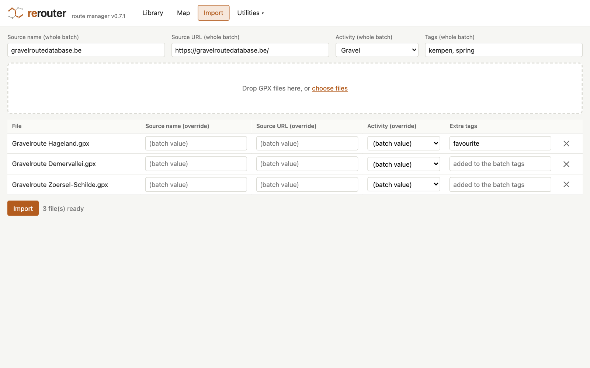
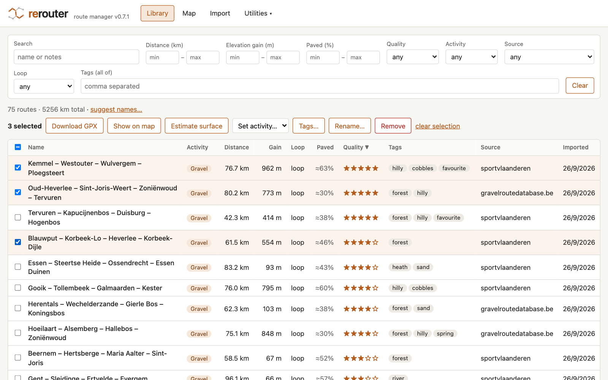
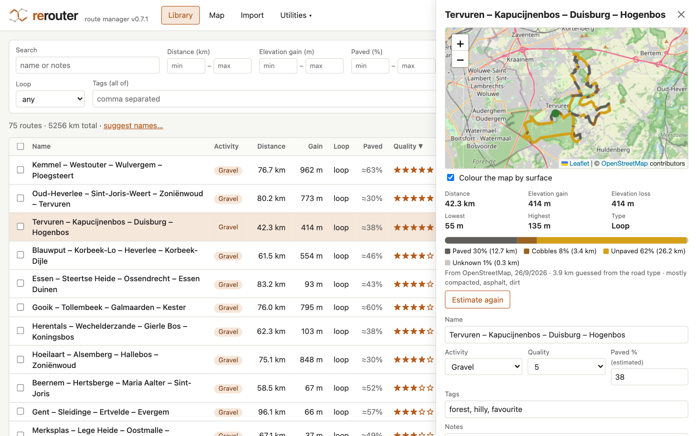
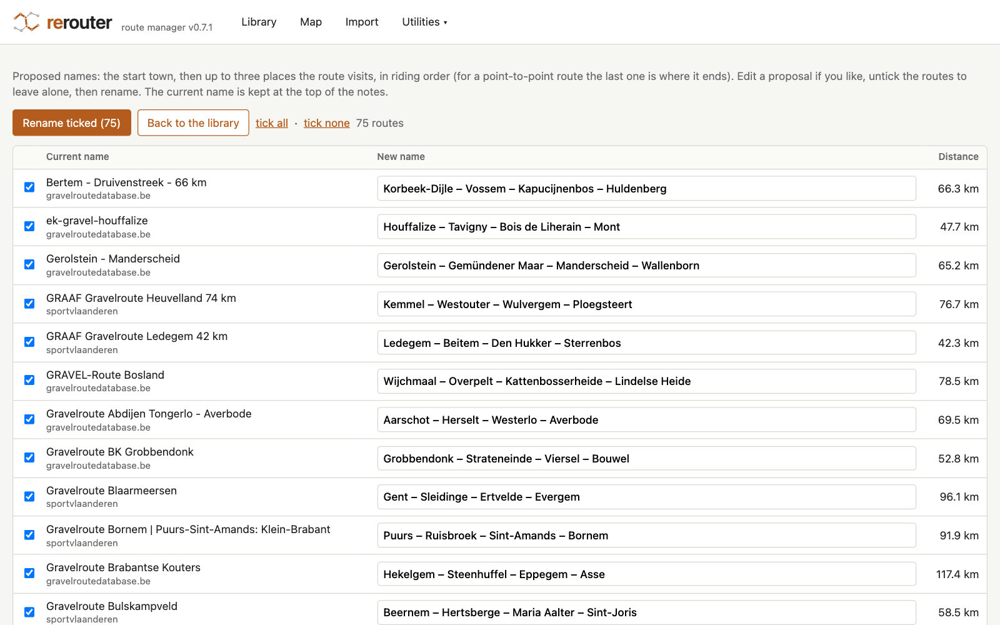
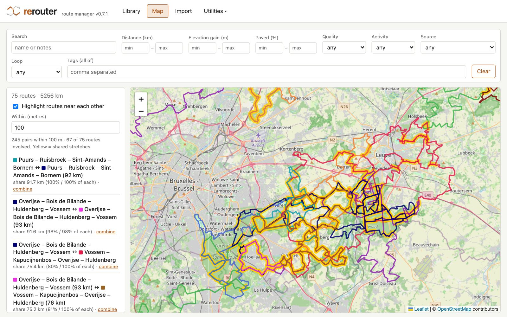
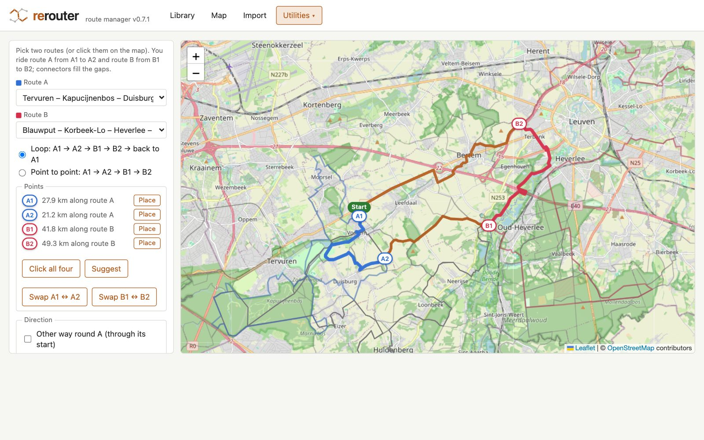
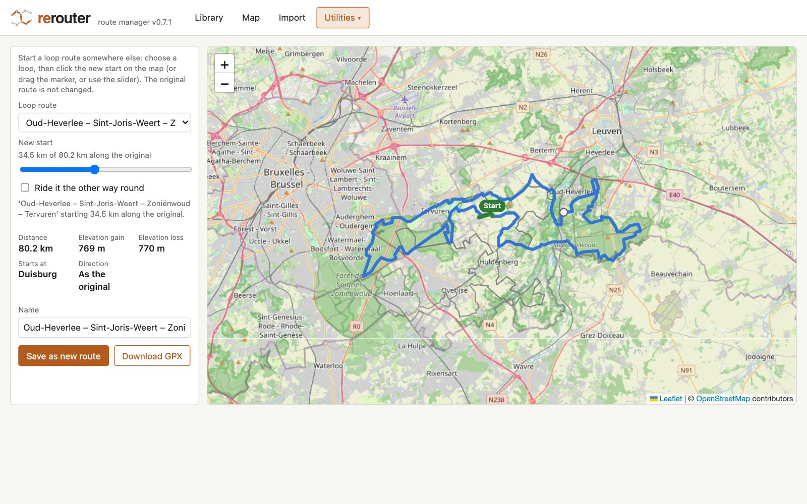
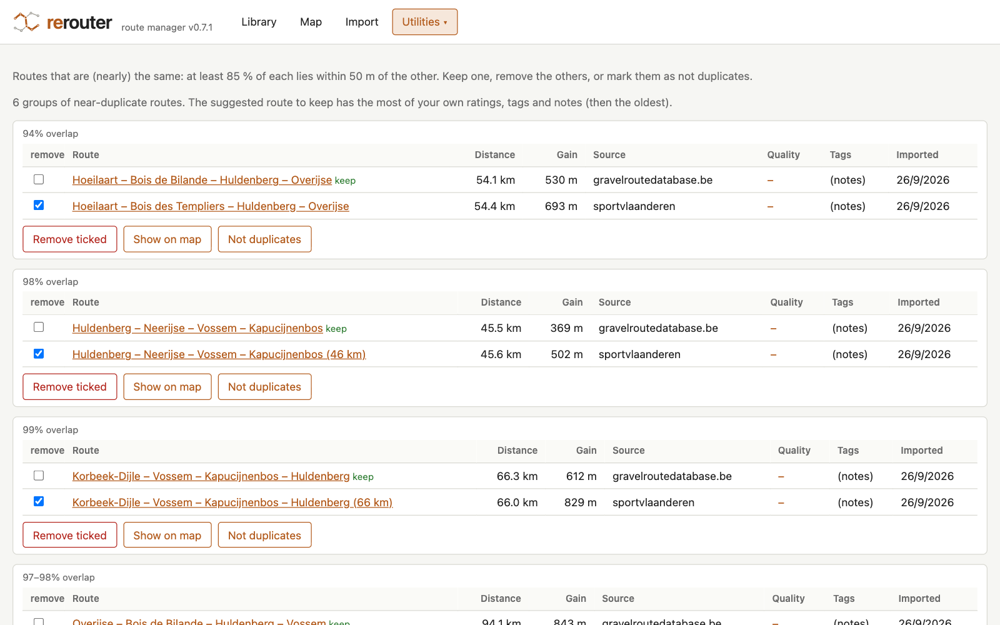

<picture>
  <source media="(prefers-color-scheme: dark)" srcset="docs/logo-wordmark-dark.svg">
  
</picture>

# rerouter — route manager

A web app to manage a personal library of routes (GPX files) for gravel cycling, road cycling
and hiking: import them, compute stats, tag and rate them, show them on a map, and combine two
routes into a new one with automatically routed connectors (via BRouter). Formerly *regraveler*.

The whole app is one page (`web/`) that runs in the browser, and it runs two ways:

- **On your own server** (`docker compose up`): the page is served by a small Python server
  that stores the library (SQLite + your GPX folder) and passes routing requests on to a
  self-hosted BRouter. Every browser on your network sees the same library.
- **As a static site** (e.g. GitHub Pages): the same page keeps the library in the browser
  (IndexedDB) and uses the public BRouter at brouter.de. Nothing to install; one browser is
  one library.

Both use the same backup format, so a library moves between them in either direction.

**Version:** 0.8.0 · **Status: phase 4 (import, library, map, surface estimate; utilities: combine, change start point, duplicates).** See [CLAUDE.md](CLAUDE.md) for
the full plan and [CHANGELOG.md](CHANGELOG.md) for the version history.

## What it does

- **Import** GPX files by drag and drop: many files at once, whole folders or zip files. On a
  server, the Import screen also offers the GPX files that are already in its `gpx/` folder.
  - Source name, URL and **activity** (gravel, road or hiking; default gravel) per batch, with
    per-file override. If no URL is given, the link inside the GPX file (if any) is used.
  - **Tags** for the whole batch, plus optional extra tags per file (added to the batch tags).
  - Computed on import: distance, elevation gain/loss (smoothed, see below), min/max elevation,
    start/end point, bounding box, loop detection (start and end within 200 m) and a
    simplified geometry for maps.
  - A GPX file with several tracks (e.g. `Start Bertem.gpx`, which holds 5 routes) becomes one
    route per track.
  - **Duplicates:** an identical file (same SHA-256) is skipped, and so is the same track in a
    different file (same coordinates, but e.g. another name, encoding or creator). Routes with
    very similar geometry (≥ 85 % of each route within 50 m of the other) are imported but
    flagged.
  - **Surface:** after an upload, the paved % of the new routes is estimated in the background
    from OpenStreetMap (see below). In the browser version this is off by default (it would send
    many requests to the shared public BRouter server); switch it on under *Library & settings*.
  - **Name:** new routes are named after the places they visit (see *Route names*); the name
    from the file is kept at the top of the notes (`Original name: …`).



- **Library:** sortable table with filters on activity, distance, elevation gain, paved %,
  quality, tags, source, loop/point-to-point and a text search. Filters are kept in the URL.
- **Activity:** every route is a gravel, road or hiking route (routes from before 0.6.0 start as
  gravel). Change it in the route panel, or for a selection with *Set activity…*. The activity
  also picks the combiner's routing profile (gravel → `gravel`, road → `fastbike`,
  hiking → `hiking-mountain`).
- **Select several routes** with the checkboxes in the library (the header box selects all
  shown routes), then:
  - **Download GPX:** one route downloads its original file; several download as `routes.zip`
    with the original files (a multi-track file is included once).
  - **Show on map:** the map (and library) show only the selected routes until you click
    *show all routes* or *Clear*.
  - **Tags…:** add one or more tags to all selected routes, or remove a tag from all of them
    (the panel lists the tags on the selection with how many routes have each, e.g. `forest 3/5`).
  - **Estimate surface:** (re)estimates the paved % from OpenStreetMap; progress is shown next
    to the route count.
  - **Remove:** removes them from the library after one confirmation (on a server the GPX files
    stay in the `gpx/` folder; in the browser version they are removed with the routes).



- **Route details:** map, stats, edit metadata (name, quality 1–5, paved %, tags, notes,
  source), list of similar/overlapping routes, download of the original GPX, remove from library.
- **Surface from OpenStreetMap:** each route's surface is estimated as *paved*, *cobbles*
  (sett/cobblestones, counted as paved), *unpaved* and *unknown*. The route panel shows the
  breakdown as a bar, colours the map by surface, and has *Estimate again*. The paved % in the
  library comes from the estimate (shown as ≈38%) unless you type your own value, which then
  always wins; the panel offers *use the estimate* to switch back, and clearing the field does
  the same. Needs BRouter (see Docker); routes outside the downloaded tiles can't be estimated.
  The browser version uses the public BRouter at brouter.de, one request at a time.



- **Route names:** *suggest names…* above the library (or *Rename…* for selected routes) opens
  a review screen with a proposed name per route: the start town, then up to three places the
  route visits, in riding order, e.g. *Tervuren – Kapucijnenbos – Duisburg – Hogenbos* (for a
  point-to-point route the last place is where it ends). Edit proposals, untick routes to leave
  alone, and rename; the current name is kept at the top of the notes (only the first time).
  Routes with the same proposal get the distance added.



- **Map:** all routes that match the filters (the same filter bar as the library) drawn as
  coloured lines on an OpenStreetMap map. Hover for the name, click a route to open its details
  (the side list then shows only the routes near it). "Show on map" in the route panel jumps there.
- **Routes near each other:** tick *Highlight routes near each other* and set a distance
  (default 100 m). Routes that overlap or come within that distance of another route stay
  coloured, the rest fade out. Shared stretches are drawn in yellow, and for near misses a
  dashed line marks the closest points. The side list shows every pair (shared km, % of each
  route, or the gap in metres); click a pair to zoom to it.
- The filters, the active view and the proximity setting are kept in the URL, so a bookmark
  brings back the same screen.
**Utilities** (the *Utilities* menu in the header) are the operations on routes:



- **Combine** two routes into a new one by picking the part of each route you want to ride:
  1. Pick route A and B (dropdowns, click them on the map, "Combine…" in a route's
     detail panel, or "combine" next to a pair in the map's proximity list).
  2. The app suggests four points where the routes come closest: you ride route A from A1 to
     A2 and route B from B1 to B2.
  3. Change them with *Click all four* (click A1, A2, B1, B2 on the map in turn; Esc cancels),
     *Place* next to a single point, or drag a point along its route. Clicks snap onto the
     route. *Suggest* puts the suggested points back.
  4. The gaps are filled with connectors routed by BRouter (the profile follows the routes'
     activity: *gravel*, *fastbike* for road, *hiking-mountain* for hiking; for gravel optionally
     *prefer unpaved paths*; other profiles or plain straight lines are possible).
     Points less than 25 m apart are joined directly.
  5. Preview with total distance, elevation gain, the km on each route and connector lengths.
  6. Save as a new route (a new GPX file in `gpx/derived/`, source *combined*, with the parent
     routes recorded and linked in its detail panel), or just download the GPX.
  - **Loop:** A1 → A2 → connector → B1 → B2 → connector back to A1. The loop starts at A1.
  - **Point to point:** A1 → A2 → connector → B1 → B2.
  - The riding direction on a route follows the order of its two points: *Swap A1 ↔ A2* (or
    B1 ↔ B2) rides it the other way. When the connectors of a loop cross each other, the app
    says so; swapping B1 and B2 usually fixes it. For loop routes, *Other way round A/B* takes
    the other part of that loop (through its start). *Ride the whole result the other way*
    reverses the direction.



- **Change start point** of a loop route: choose a loop (dropdown, click it on the map, or
  *Change start…* in a loop's detail panel), then click where it should start (clicks snap onto
  the route), drag the *Start* marker, or use the slider. The preview shows the stats, the town
  where it now starts and the first kilometre in green, so the riding direction is visible;
  *Ride it the other way round* reverses it. Download the GPX, or save it as a new route (a new
  file in `gpx/derived/`, with the original linked as its parent and its tags, activity,
  rating, paved % and source copied). The new route is marked as "not duplicates" of the
  original, so the Duplicates utility doesn't suggest removing one of them.



- **Duplicates:** all groups of near-duplicate routes in the library (e.g. the same route
  downloaded from two sites), with overlap, source, rating and tags per route, "identical
  track" and "ridden the other way" hints, and a suggestion which one to keep (the one with the
  most of your own ratings, tags and notes, then the oldest). *Remove ticked*, *Show on map*, or
  *Not duplicates* (hides the group). Below that, **variants**: routes that lie (almost)
  entirely on a longer route, such as a short loop inside a long one.

- **Library & settings** (also in the Utilities menu): where the library is stored and how much
  space it takes, **backup** (one zip with every route, your ratings, tags and notes, and all
  original GPX files) and **restore**, the BRouter server to use (with a test button), whether
  new routes are named and their surface estimated automatically, and *Remove everything*.

Original GPX files are never modified.



## Run with Docker

```bash
docker compose up -d --build
```

Open http://localhost:8082 (or `http://<server>:8082`).

The first start downloads BRouter's routing data for Belgium and its surroundings
(~640 MB, see [BRouter routing data](#brouter-routing-data)) and builds BRouter from source, so
it takes a few minutes. Later starts are quick.

Volumes (bind mounts next to `docker-compose.yml`):

| Host folder | In container | Contents |
|---|---|---|
| `./data` | `/data` | `routes.db` (SQLite) |
| `./gpx` | `/gpx` | The GPX library. Files already here are referenced in place; uploaded files are stored in `gpx/uploads/<source>/`, combined routes and new start points in `gpx/derived/`, files from a restored backup that weren't here yet in `gpx/restored/`. |
| `./brouter/segments4` | `/segments4` (brouter) | BRouter routing data tiles (`.rd5`) |

Services: `app` (serves the page, stores the library, and passes `/brouter` requests on to
BRouter), `brouter` (routing engine, built from the official
[abrensch/brouter](https://github.com/abrensch/brouter) v1.7.10 source; only reachable through
the app, not published on the host) and `brouter-segments` (one-off job that downloads missing
routing data before BRouter starts).

### BRouter routing data

BRouter needs routing data tiles from [brouter.de/brouter/segments4](https://brouter.de/brouter/segments4/):
5×5 degree files named after their south-west corner. The default set covers Belgium and the
neighbouring areas:

| Tile | Covers | Size (approx.) |
|---|---|---|
| `E0_N50` | 0–5° E, 50–55° N: Flanders, Brussels, west of the Netherlands | 80 MB |
| `E5_N50` | 5–10° E, 50–55° N: Limburg, east of the Netherlands, western Germany | 180 MB |
| `E0_N45` | 0–5° E, 45–50° N: south of Wallonia, northern France | 130 MB |
| `E5_N45` | 5–10° E, 45–50° N: Luxembourg, the Ardennes south of 50° N | 250 MB |

To use other tiles, set `BROUTER_TILES` (space separated) in a `.env` file next to
`docker-compose.yml`, e.g. `BROUTER_TILES=E0_N50 E5_N50`, and run `docker compose up -d`.
If a connector falls outside the downloaded tiles, the combiner says which tile is missing.

The tiles are rebuilt weekly from OpenStreetMap. To refresh them (only changed tiles are
downloaded), then restart BRouter:

```bash
docker compose run --rm brouter-segments update
```

```bash
docker compose restart brouter
```

### Import an existing folder of GPX files

Put the files somewhere under `./gpx` (subfolders are fine), open the Import screen and click
*Add them to the list*: it lists every GPX file in the folder that isn't in the library yet.
Files in a subfolder get the subfolder's name as source name (unless you fill in a source name
for the batch), and they are referenced where they are, not copied. Doing it again is safe:
files that are already imported are not offered again, and neither are files that were skipped
(the same track as a route already in the library, or not a usable GPX file) or that you
dismissed with *Ignore them*. That goes by content, so every copy of such a file is ignored;
the files themselves stay in the folder, and *offer them again* brings them back. Dropping a folder on the Import screen
works too; files that aren't in `./gpx` yet are then copied into `gpx/uploads/<source>/`.

### Upgrading from 0.7.x (the Python version)

Up to 0.7.x the route logic ran in Python on the server. Now it runs in the page, and the
server only stores the library. The first start moves your library to the new storage by
itself: every route with its id, ratings, tags, notes, surface estimate and "not duplicates"
decisions, referencing the GPX files where they are. Routes from early versions without a
track hash get one from their GPX file the first time the page opens, so duplicates are
recognised. The old tables stay untouched in
`routes.db`, so the old version still works on the same database. By hand:
`docker compose run --rm app python -m app.cli migrate`.

GeoNames data is no longer downloaded into `data/geonames/`: the place data ships with the page
(`web/data/places/`). That folder can be deleted.

### Backups

*Utilities › Library & settings › Download backup* (or `docker compose run --rm app python -m
app.cli backup /data/backup.zip`) writes one zip: `library.json` with every route, setting and
"not duplicates" pair, and every original GPX file as `gpx/<sha256>.gpx`. Restoring it (in the
page, or `python -m app.cli restore <file>`) replaces the library; route ids are kept. The
browser version reads and writes the same format.

## Run as a static site (GitHub Pages)

The `web/` folder is the whole app. Served by any static web server it keeps the library in the
browser; it must be served over http(s), not opened as a file.

```bash
python3 -m http.server 8000 --directory web
```

On GitHub, `.github/workflows/pages.yml` runs the JavaScript tests and publishes `web/` to
GitHub Pages on every push to `main` that touches it. Turn it on once under *Settings › Pages ›
Build and deployment › Source: GitHub Actions*. The app is then at
`https://<user>.github.io/<repo>/`.

In the browser version everything stays on the device: the library is in the browser's
IndexedDB (the page asks the browser to keep it), and clearing the site's data or a private
window wipes it, so download a backup now and then. The only data sent anywhere are the points
being routed, to the BRouter server (the public one at brouter.de by default, which allows
requests from any web page; *Library & settings* can point it at your own BRouter, as long as
that one allows cross-origin requests).

## Run locally (development)

The server, Python 3.12:

```bash
python3.12 -m venv .venv
.venv/bin/pip install -r requirements-dev.txt
.venv/bin/uvicorn app.main:app --reload
```

The app then runs at http://localhost:8000 with the database in `./data` and the library in
`./gpx`. Override with the `DATA_DIR` and `GPX_DIR` environment variables. The page is served
from `web/` (`WEB_DIR`), so changes to the page only need a reload of the browser.

The combiner and the surface estimate need a BRouter server at `BROUTER_URL` (default
`http://localhost:17777`; the page reaches it through the app's `/brouter`). Without Docker:
download a release zip from [BRouter's releases](https://github.com/abrensch/brouter/releases)
(needs Java 17+) and one or more tiles, then run from the unpacked folder:

```bash
java -Xmx128M -cp brouter-1.7.10-all.jar btools.server.RouteServer segments4 profiles2 customprofiles 17777 1
```

Or set `BROUTER_URL=https://brouter.de` to pass requests on to the public server. Without
BRouter, the combiner still works with *Straight lines (no routing)*.

Run the tests: the route logic (stats, stitching, similarity, names, surface, import) is tested
with Node's built-in test runner (Node 20+, no dependencies), the server with pytest:

```bash
cd web && npm test
```

```bash
.venv/bin/python -m pytest
```

The pytest run includes a check that backups made by the page restore on the server and the
other way round (it needs Node; skipped without it).

The screenshots in this README are made with `docs/screenshots/take_screenshots.py` (Playwright,
driving your installed Chrome). It drives the page served by two scratch rerouter servers and
can fill their libraries itself, by importing GPX files through the Import screen (`--seed`) or
by restoring backups (`--restore`); its docstring explains the setup. It's a docs helper, not
part of the app, so Playwright isn't in the requirements.

## How the stats are computed

All of this runs in the page (`web/js/`), for both ways of running. The results were checked
against the Python version (up to 0.7.x) on 77 real routes: identical distance, loop detection
and generated name for all of them, identical elevation gain for 74 (the other 3 differ by
1–2 m: elevation data in whole metres sits right at the 1 m hysteresis threshold).

- **Distance:** geodesic (WGS84) distance between consecutive points.
- **Elevation:** the elevation profile is resampled every 10 m along the route, smoothed with a
  50 m moving average, and then ascent/descent is summed with a 1 m hysteresis (small
  up/down wiggles are ignored). Missing `<ele>` values are interpolated. These settings were
  calibrated against the `77km-430hm`-style values in the gravelroutedatabase.be track names
  (median within ~5 %). Note that different sources use different elevation data, so the same
  route can show a different gain depending on where the file came from.
- **Similarity:** routes are projected to a metric CRS (EPSG:3035, Europe) and compared with a
  bounding-box prefilter, then the share of each route's length lying within 50 m of the other.

- **Routes near each other (map):** a bounding-box sweep over the projected routes is the
  prefilter, then the exact line-to-line distance is checked (with a grid index of each route's
  segments). For each pair the shared stretches are each route's parts within the chosen
  distance of the other, computed exactly: the area within a distance of a segment is convex,
  so each segment's covered part is one interval. A stretch ridden twice (out and back) counts
  twice, as it does in the route's length. It runs in a Web Worker, so the page stays
  responsive.

- **Change start point:** the loop is cut from the full-resolution GPX points at the point
  nearest to the chosen start and ridden round once, back to that point; the gap between the
  original start and end (at most ~200 m for a loop) is joined directly.

- **Combiner:** the parts of A and B are cut from the full-resolution points of the original GPX
  files (not the simplified map lines), with interpolated points exactly at the chosen
  points. The stitching works on a list of parts (route + start + end point), so combining more
  than two routes is a matter of UI; the page's service (`combinePreview` in
  `web/js/service.js`, with `parts`) already accepts up to six. Suggestions come from a distance matrix of points sampled every 50 m along both
  routes; the second connection of a loop is the closest pair that is at least 2 km (or 15 % of
  the shorter route) away from the first along both routes. The stats of the result are
  computed the same way as for imported routes. Connector elevations come from BRouter (SRTM),
  so there can be small elevation jumps where they join the original tracks.

- **Surface estimate:** the GPX track is "map matched" with BRouter: a route is requested
  through waypoints every 300 m along the track with the `shortest` profile, so BRouter follows
  the track itself (the matched length is typically within 1 % of the route length), and with
  `processUnusedTags=1` BRouter reports every OpenStreetMap tag of each way it used. Each
  stretch is classified by its `surface` tag; without one, the road type decides (a residential
  street or cycleway is paved, a `grade1` track paved, other tracks and paths unpaved; the panel
  says how many km were guessed this way). paved % = (paved + cobbles) / (paved + cobbles +
  unpaved), and is left empty when more than half of the route is unknown.
- **Route names:** place data comes from [GeoNames](https://www.geonames.org/) (CC BY 4.0) for
  Belgium, the Netherlands, Luxembourg, Germany and France, built by
  `web/tools/build_places.py` into 1 × 1 degree tiles in `web/data/places/` (11 MB in all, about
  150 KB per tile, 40 KB compressed; a route loads only the tiles it passes). Towns and villages are ranked by population (villages
  without one only count if they're widely known); landmarks are named forests, heaths, hills,
  parks, lakes, castles and abbeys the route passes close to. Names are in Dutch where GeoNames
  has one (Zoniënwoud rather than Forêt de Soignes; `build_places.py --lang` picks another
  language). The start is the nearest real
  town to the start point; the places are the most notable one in each third of the route.
  Rebuild the tiles with `python3 web/tools/build_places.py` (standard library only; downloads
  about 150 MB of GeoNames dumps once), e.g. with `--countries` to add a country.
- **Duplicates:** a hash of each track's coordinates (rounded to ~1 m) finds the same track in
  different files. The Duplicates utility compares all routes (bounding-box sweep, then the
  exact shares) and groups routes
  where ≥ 85 % of each lies within 50 m of the other; a route with ≥ 90 % on another is listed
  as a variant. "Ridden the other way" compares positions along both routes.

Settings: the thresholds (loop 200 m, similarity 50 m / 85 %, variants 90 %, proximity
100 m default and 5000 m maximum, direct join 25 m, surface waypoints every 300 m, the BRouter
profiles) are in `web/js/config.js`. The ones you're likely to change are in the page, under
*Utilities › Library & settings*: the BRouter server, automatic names and surface estimates,
and the default distance for routes near each other. They are stored with the library.

The server's environment variables: `DATA_DIR` (`./data`), `GPX_DIR` (`./gpx`), `WEB_DIR`
(`./web`), `DATABASE_URL` (SQLite in `DATA_DIR`), `BROUTER_URL` (`http://localhost:17777`; set to
`http://brouter:17777` in docker-compose; empty for no `/brouter`), `BROUTER_TIMEOUT_S` (120),
`MAX_FILE_BYTES` (50 MB).

## Adding metadata fields

A route is a JSON document to the server, so a new field needs no server or database change: set
it in `importGpx` (`web/js/service.js`), allow it in `updateRoute`, and add it to the route panel
(`web/index.html`, `web/js/app.js`). Routes that don't have it yet read it as empty.

## Project layout

```
web/                 the app: one page, runs in the browser (and as a static site)
  index.html, style.css
  js/
    app.js           the UI (vanilla JS + Leaflet)
    service.js       everything the app does: import, filters, combine, duplicates, names, ...
    db.js            the library in memory, stored through a backend: IndexedDB (browser) ...
    remote.js        ... or the rerouter server's storage API (self-hosted)
    gpx.js           GPX reading and writing (a small XML reader, also runs in Node and workers)
    stats.js         distance, smoothed elevation gain/loss, loop detection, simplified geometry
    geo.js           EPSG:3035 projection, WGS84 geodesic distance, line helpers, grid index
    similarity.js    near-duplicates, routes near each other, duplicate groups
    combiner.js      cutting, direction handling and stitching of combined routes; new start points
    brouter.js       client for the BRouter HTTP API
    surface.js       surface estimate (map matching via BRouter)
    places.js        route names from GeoNames places (start town + places visited)
    zip.js, backup.js  zip files and library backups
    worker.js        Web Worker for "routes near each other"
    config.js        settings and the version
  data/places/       GeoNames place tiles
  tools/build_places.py  builds data/places/ from the GeoNames dumps
  tests/             Node tests of the route logic
app/                 the server (self-hosted version): stores the library, serves web/
  main.py            FastAPI: storage API, backups, /brouter proxy, the page
  store.py           routes (JSON documents), GPX files, pairs, settings, backups
  legacy.py          one-time move of a 0.7.x library to the new store
  models.py, db.py   SQLAlchemy models and database setup
  cli.py             backup / restore / migrate
tests/               pytest tests of the server
docs/
  screenshots/       README screenshots and the script that takes them
brouter/
  download-segments.sh  downloads BRouter routing data tiles (used by docker-compose)
.github/workflows/pages.yml  publishes web/ to GitHub Pages
```

## Version Tracking

Versions follow `a.b.c` (major / minor / dot) and every release is tagged `v<a.b.c>`.
The version appears in these places, which must stay in sync:

- `app/__init__.py` — `__version__` (source of truth; served at `/api/info`, shown in the header of the self-hosted version)
- `web/js/config.js` — `VERSION` (shown in the header of the browser version)
- `web/package.json` — `version`
- `README.md` — the **Version:** line at the top
- `CHANGELOG.md` — one row per release
